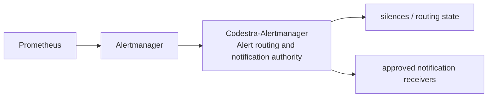
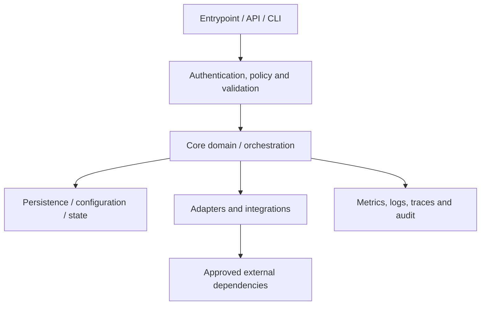
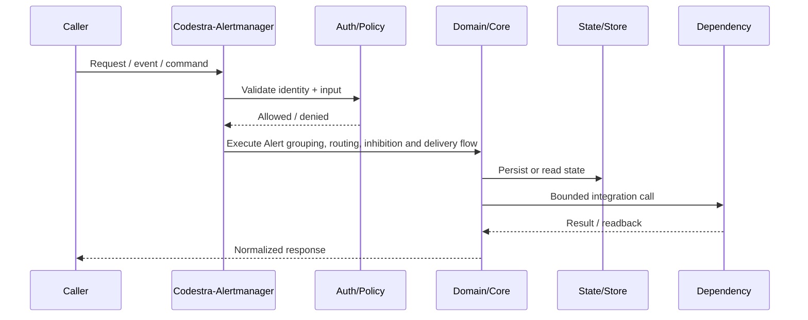
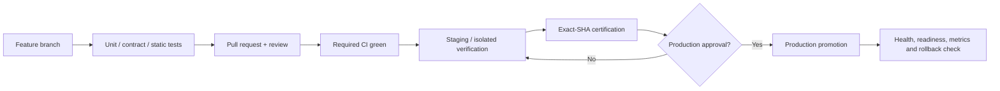
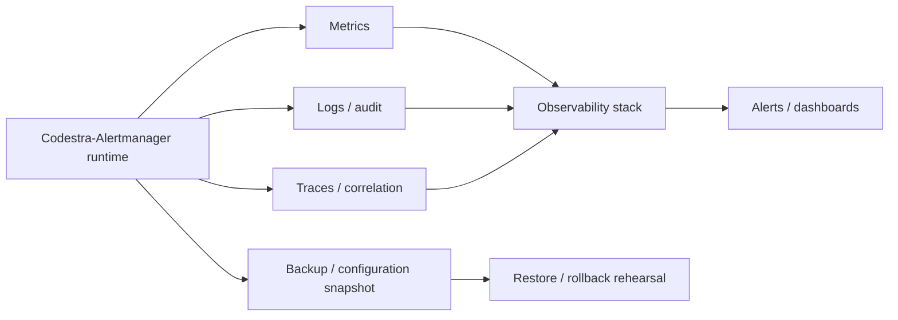

# Codestra-Alertmanager — Architecture Charts

> Repository: `appolon1908/Codestra-Alertmanager`  
> Baseline branch: `main`  
> Purpose: repository-local visual architecture. These charts describe the intended ownership boundary and should be updated with code changes.

## 1. System context

## 2. Internal component architecture

## 3. Critical runtime flow

## 4. Deployment and promotion

## 5. Observability and recovery

## Architecture ownership

- **Repository role:** Alert routing and notification authority
- **Primary boundary:** Alertmanager
- **State/configuration:** silences / routing state
- **Downstream/consumers:** approved notification receivers
- Cross-repository effects must use approved contracts; do not create hidden direct-write paths.
- Production effects remain separately gated and are not authorized by this document.
